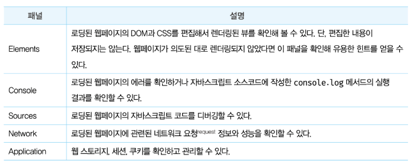
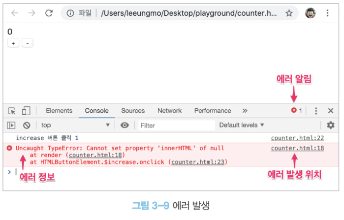
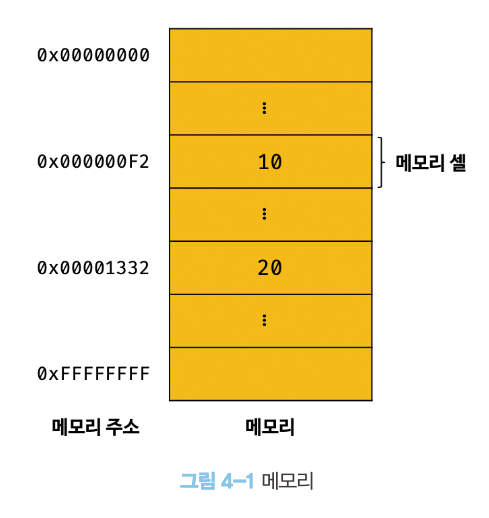
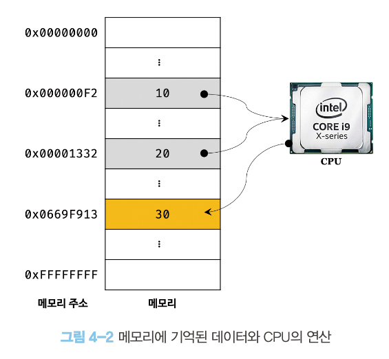
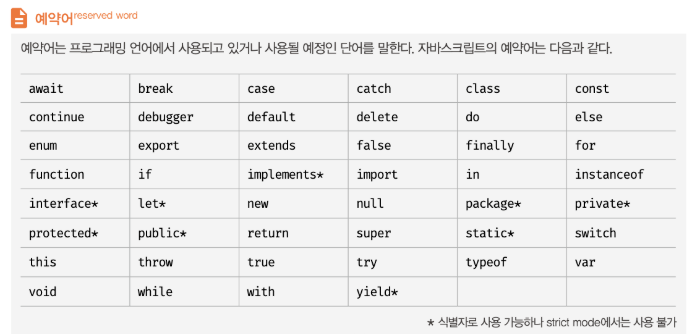
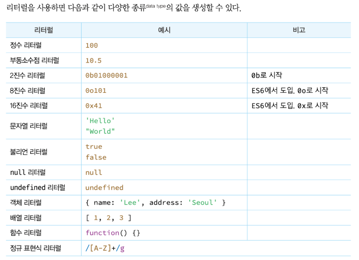
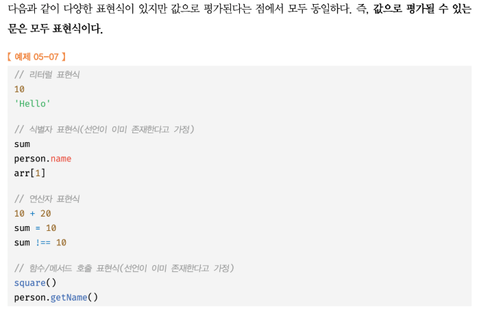
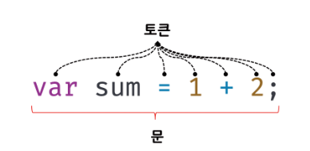

# 자바스크립트 딥 다이브

# 01장 프로그래밍

## 1-1. 프로그래밍 이란?

컴퓨터에게 실행을 요구하는 일종의 커뮤니케이션

문제 요구사항 명확히 이해 ➡️ 적절한 문제 해결 방안 정의

> - 복잡함을 단순하게 분해
> - 자료 정리 및 구분
> - 순서에 맞게 행위 배열

컴퓨터의 입장에서 문제를 바라봐야 한다. (aka. 컴퓨팅 사고)

> 논리적, 수학적 사고 필요
> 해결 과제를 작은 단위로 분해
> 패턴화 하여 추출
> 모든 개념은 평가 가능하도록 정의


문제 해결 능력 : 

> 직감과 직관의 영역
> 이는 문제를 바라보는 사고와 경험에 영향을 받는다.


## 1-2. 프로그래밍 언어

사람이 이해할 수 있는 약속된 문구(syntax) 문법

일종의 번역기 (compiler / interpreter)


자연어 : 
인간이 자연스럽게 발달시킨 언어 (예: 영어, 프랑스어)

인공어 : 
특정한 목적을 위해 인위적으로 만들어진 언어 (예: 에스페란토, Python)


## 1-3. 구문(syntax)과 의미(semantics)


---

# 02 자바스크립트란?

## 2-1. 자바스크립트의 탄생

1995년 넷스케이프 커뮤니케이션즈가 웹페이지의 보조적 기능을 수행하기 위해 Brendan Eich 브랜던 아이크가 만든 웹브라우저에서 동작하는 경량프로그래밍 언어 

## 2-2. 자바스크립트의 표준화

1996년 마이크로소프트가 만든 Javacript의 파생버전 Jscript를 익스플로러 3.0에 탑재

즉, 자사 브라우저에만 동작하는 기능 추가

크로스 브라우징 이슈 발생

Javascript 파편화 방지, 모든 사이트 동작 Javascript 표준화 대두

컴퓨터 시스템 표준 관리 비영리 표준화 기구 - ECMA 인터네셔널 - 표준화 요청


## 2-3. 자바스크립트 성장의 역사

렌더링(rendering) : 
HTML, CSS, JS 문서를 해석해서 브라우저에서 시각적으로 출력하는 것 의미

### 2-3-1. Ajax

1999년 Javascript를 이용해서 서버와 브라우저가 비동기 방식으로 데이터를 교환하는 통신 기능

### 2-3-2. jQuery

2006년 DOM 쉽게 제어, 크로스 브라우징 어느정도 해결
구글 맵스 활용

### 2-3-3. V8 자바스크립트 엔진

구글 맵스로 인해 Javascript로 웹 어플리케이션 구축 시도가 늘면서 Javascript의 엔진 필요성 대두

2008년 구글 V8 자바스크립트 엔진은 요구사항 부합하는 빠른 성능 보유

### 2-3-4. Node.js

2009년 Javascript 런타임 환경

브라우저 자바스크립트 엔진에서만 동작하던 Javascript를 브라우저 외 환경에서 독립시킨 자바스크립트 실행 환경

서버 사이드 어플리케이션에 주로 사용

SPA (single page application)에 적합

CPU 사용률이 높은 어플리케이션 사용 권장X

### 2-3-5. SPA 프레임워크

복잡해진 모던 웹 애플리케이션 개발의 어려움과 기존 개발 방식의 확장성 부족 문제를 해결하기 위해, 컴포넌트 기반 개발(CBD) 방법론을 활용한 SPA 프레임워크(Angular, React, Vue.js, Svelte 등)가 등장


## 2-4. 자바스크립트와 ECMAScript

ECMAScript는 자바스크립트의 표준 사양(ECMA-262)으로, 프로그래밍 언어의 핵심 기능과 브라우저가 지원하는 클라이언트 사이드 Web API(DOM, Canvas, fetch 등)를 통해 웹 개발을 가능하게 하는 언어


## 2-5. 자바스크립트의 특징

자바스크립트는 웹을 구성하는 유일한 프로그래밍 언어로, 컴파일 없이 실행되는 인터프리터 언어이며, 명령형/함수형/프로토타입 기반 객체지향을 모두 지원하는 멀티 패러다임 언어


## 2-6. ES6 브라우저 지원 현황


---

# 03 자바스크립트 개발환경과 실행 방법


## 3-1. 자바스크립트 실행 환경

Node.js는 브라우저 외부에서 JavaScript를 실행할 수 있는 런타임 환경을 제공하여, JavaScript로 서버 사이드 개발과 다양한 애플리케이션 개발을 가능하게 한다

>- Node.js는 실제로 브라우저와 동일한 V8 JavaScript 엔진을 사용합니다
>- 브라우저 외부(서버 사이드)에서 JavaScript를 실행할 수 있게 해줍니다
 Node.js를 사용하는 주된 이유는 단순히 "동일한 엔진 환경"을 만들기 위함이 아니라:
> 1. **풀스택 JavaScript 개발** - 프론트엔드와 백엔드를 같은 언어로 개발
> 2. **서버 사이드 개발** - 웹 서버, API 서버 구축
> 3. **개발 도구 생태계** - npm 패키지 관리, 빌드 도구 등
> 4. **비동기 I/O 처리** - 높은 동시성 처리 능력
> 5. **크로스 플랫폼 애플리케이션** - 데스크톱 앱, 모바일 앱 개발

웹 크롤링 : 
서버에서 웹사이트의 콘텐츠를 수집하기 위해 웹사이트에서 HTML 문서를 가지고 온 다음
가공해서 필요한 데이터만 추출하는 경우

## 3-2. 웹 브라우저

### 3-2-1. 개발자 도구



### 3-2-2. 콘솔

```js
console.log // 메서드를 사용하여 결과를 콘솔에 출력하는 함수
```

자바스크립트 코드를 직접 입력해 그 결과를 확인할 수 있는 REPL(Read Eval Print Loop: 입력 수 행 출력 반복) 환경으로 사용 가능


### 3-2-3. 브라우저에서 자바스크립트 실행




### 3-2-4. 디버깅

에러 위치를 클릭하면 코드 디버깅할 수 있는 Source 패널로 이동하게 된다. 


## 3-3. Node.js

클라이언트 사이드 웹 애플리케이션은 브라우저에서만 동작하지만, 프로젝트 규모가 커지면서 React, Angular 등의 프레임워크와 Babel, Webpack 등의 개발 도구들을 사용하게 되었고, 이를 위해 Node.js와 npm이 필요

### 3-3-1. Node.js와 npm 소개

### 3-3-2. Node.js 설치

### 3-3-3. Node.js REPL


## 3-4. 비주얼 스튜디오 코드

### 3-4-1. 비주얼 스튜디오 코드 설치

### 3-4-2. 내장 터미널

### 3-4-3. Code Runner 확장 플러그인

### 3-4-4. Live Server 확장 플러그인

소스 코드를 수정할 때 마다 수정 사항을 브라우저에 자동으로 반영


---


# 04 변수

## 4-1. 변수란 무엇인가? 왜 필요한가?


```txt
10 + 20
```

10, 20,+라는 기호(리터럴eral과 연산자peralor)의 의미를 알고 있어야 하며, 10+ 20이라는 식(표현식expresion) 의 의미도 해석(파싱asing)할 수 있어야 한다. 

컴퓨터는 연산 과 기억을 수행하는 부품이 나눠져 있다.

CPU를 사용해 연산
메모리를 사용해 데이터를 기억

> 메모리(memory)는 데이터를 저장할 수 있는 메모리 셀(memory cell)의 집합
> 메모리 셀 하나의 크기는 1바이트(8 비트)
> 메모리 셀의 크기(1바이트 단위)로 데이터를 저장(write)하거나 읽어(read)들인다.



위 예제의 숫자 값 10과 20은 메모리 상의 임의의 위치(메모리 주소)에 기억(저장)

CPU는 이 값을 읽어 들여 연산 수행

연산 결과로 생성된 숫자 값 30도 메모리 상의 임의의 위치에 저장

다음 그림에 는 메모리에 저장된 숫자 값을 편의상 10진수로 표기했다. 하지만 메모리에 저장되는 모든 값은 2진수로 저 장된다는 것



만약 30을 재사용하고 싶다면

> 메모리 주소(0x0669F913)를 통해 값 30에 직접 접근할 수 있지만, 이는 치명적 오류를 발생시킬 수 있어 자바스크립트는 개발자의 직접적인 메모리 제어를 허용하지 않는다.

변수 : 
하나의 값을 저장하기 위해 확보한 메모리 공간 자체
그 메모리 공간을 식별하기 위해 붙 인 상징적인 이름

상징적 이름인 변수는 프로그래밍 언어의 컴파일러 또는 인터프리터에 의해 값이 저장된 메모리 공간 주소로 치환되어 실행


## 4-2. 식별자

식별자는 어떤 값을 구별해서 식별할 수 있는 고유한 이름으로, 변수나 함수 등의 메모리 공간에 저장된 값에 접근하기 위해 사용하는 기호이다.

## 4-3. 변수 선언

변수 생성
값을 저장하기 위한 메모리 공간 확보하고, 변수 이름과 확보한 메모리 공간 연결하여 값 저장 준비

변수 사용하기 위해 반듯이 선언 필요

```txt
var, let, const 사용
```

# 4-4. 변수 선언의 실행 시점과 호이스팅 

자바스크립트 엔진은 변수 선언이 소스코드의 어디에 있든 상관없이 다른 코드보다 먼저 실행
변수 선언이 소스코드의 어디에 위치하는지와 상관없이 어디서든지 변수를 참조 가능

변수 선언이 소스코드가 순차적으로 실행되는 런타임 이전 단계에서 먼저 실행되는 자바스크립트 고유의 특징을 변수 호이스팅(variable hoisting)이라 하며, var, let, const, function 등 모든 식별자는 호이스팅된다.

## 4-5. 값의 할당

## 4-6. 값의 재할당

변수에 값을 재할당하면 기존 값이 변경되는 것이 아니라 새로운 메모리 공간을 확보하여 새 값을 저장하고, 변수는 새로운 메모리 공간을 참조하는 것

>가비지 콜렉터 : 
애플리케이션이 할당한 메모리 공간을 주기적으로 검사하여 더 이상 사용되지 않는 메모리를 해제하는 기능으로, 자바스크립트는 이를 내장하고 있어 메모리 누수를 방지한다.

## 4-7. 식별자 네이밀 규칙

**식별자 네이밍 규칙:**

1. **특수문자 제한** - 문자, 숫자, 언더스코어(_), 달러 기호($)만 포함 가능
2. **첫 글자 제한** - 숫자로 시작할 수 없음 (문자, _, $로만 시작)
3. **예약어 금지** - `var`, `function`, `if` 등 자바스크립트 예약어 사용 불가
4. **대소문자 구분** - `name`과 `Name`은 다른 식별자

**권장 네이밍 컨벤션:**

- **카멜케이스**: 변수, 함수명 (`firstName`, `getUserInfo`)
- **파스칼케이스**: 생성자 함수, 클래스명 (`User`, `StudentInfo`)
- **스네이크케이스**: 상수 (`MAX_COUNT`, `API_URL`)

**좋은 예:**

```javascript
const userName = 'John';    // 카멜케이스
const MAX_SIZE = 100;       // 상수
function getUserData() {}   // 동사+명사
```




---


# 05 표현식과 문

## 5-1. 값

값value은 식(표현식expression)이 평가(evaluate) 되어 생성된 결과

> 평가 : 
>식을 해석해서 값을 생성하거나 참조하는 것을 의미

## 5-2. 리터럴

약속된 기호로 값을 생성하는 표기법



## 5-3. 표현식

값으로 평가될 수 있는 문(statement)

표현식이 평가되면 새로운 값을 생성 또는 기존 값 참조 한다. 



## 5-4. 문

프로그램을 구성하는 기본 단위이자 최소 실행 단위

> 프로그램 : 
>문의 집합으로 이뤄진 것

> 프로그래밍 : 
>문을 작성하고 순서에 맞게 나열하는 것



## 5-5. 세미콜론과 세미콜론 자동 삽입 기능

0개 이상의 문을 중 괄호로 묶은 코드 블록({ ... }) 뒤에는 세미콜론을 붙이지 않는다.
(예: if 문, for 문, 함수 등) - 자체 종결성(self closing)을 갖기 때문

## 5-6. 표현식인 문과 표현식이 아닌 문

변수에 할당해 보면
표현 식인 문은 값으로 평가되므로 변수에 할당 가능
표현식이 아닌 문은 값으로 평가할 수 없으므로 변수에 할당하면 에러 발생


